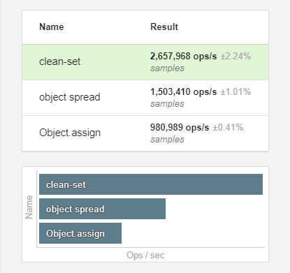

# clean-set [](https://github.com/chinanf-boy/Source-Explain)

「 Object 扩展运算符和Object.assign的深度赋值替代方法 」

Explanation

> "version": "1.1.0"

[github source](https://github.com/fwilkerson/clean-set)

[中文](./readme.md) | ~~[english](./readme.en.md)~~

## 使用

<details>

<summary> 更多信息 </summary>

``` js
let current = {
  a: { b: [], c: true },
  d: [],
  e: {
    f: { g: 'hello' },
    h: { i: 0 },
  },
};

let next = cleanSet(current, 'e.h.i', 1);

/**
 * 或者，您可以为最终参数提供一个函数
  *接收该节点的当前值。
 *
 * let next = cleanSet(current, 'e.h.i', i => i + 1);
 */

// The value is assigned
console.log(next.e.h.i !== current.e.h.i); // true

// Each parent node touched is a new reference
console.log(next.e.h !== current.e.h); // true
console.log(next.e !== current.e); // true
console.log(next !== current); // true

// Untouched references remain the same
console.log(next.e.f === current.e.f); // true
console.log(next.a === current.a); // true
console.log(next.a.b === current.a.b); // true
console.log(next.d === current.d); // true
```

</details>

---

穷

<a href="https://patreon.com/yobrave">

</a>


---

<!-- START doctoc -->
<!-- END doctoc -->

---

## package.json

``` js
 "source": "lib/index.js",
  "scripts": {
    "build": "microbundle",
    "coverage": "nyc report --reporter=text-lcov > coverage.lcov && codecov",
    "tap": "tape -r esm tests/**/*.js | tap-difflet",
    "test": "nyc --reporter=text npm run tap"
  },
```

- [microbundle {es6构建小库的0⃣️配置工具}](https://github.com/developit/microbundle)

## index.js

> 很简单, 但是在 关于地址引用 细节方面, 值得推敲 「 Es6语法 」

``` js
export default function(source, keys, update) {
  keys.split && (keys = keys.split('.')); // 变成 数组

  let next = copy(source),
    last = next, // 地址传递
    i = 0,
    l = keys.length;

  for (; i < l; i++) {
    // 每下一层, 顶层地址更换, 子地址相连
    last = last[keys[i]] =
      i === l - 1 // 直到 确切最后一层, 运行 update 或 赋值
        ? !!update.call
          ? update(last[keys[i]])
          : update
        : copy(last[keys[i]]); // <===== 在没到最后一层, 帮 last 换个顶层地址
  }

  // 因为 最后一层 的 顶层地址, 并没有换, 所以对 last[keys[i]] 的操作
  // 也是对 next 相同 层级的操作
  return next;
}

function copy(source) {
  let to = source && !!source.pop ? [] : {};
  for (let i in source) to[i] = source[i];
  return to;
}

```

1. 两次 copy ?

原本我以为 在第一次 copy 后, 

``` js
  let next = copy(source),
```

后面 `for 循环`内 的 第二次 `copy`就不需要 

``` js
copy(last[keys[i]]);
```

但是, 不行❌

2. copy的不同

因为 `copy函数` 不同 `Object.assign`

``` js
function copy(source) {
  let to = source && !!source.pop ? [] : {}; // 顶层 不同了
  for (let i in source) to[i] = source[i]; // 子 依然相连
  return to;
}
```

这个函数只对顶层的 `[]` 或者 `{}` 赋予一个新的地址

而 子数组或子对象 地址依然是与 `source{源}` 子数组或子对象 相连的

`to[i] = source[i];`

## ⚠️ 警告

从这里可以看出, javascripts 在地址上的,隐形传递

每一层的 `[]` 或者 `{}` 都是有自己的地址的

``` js
let first = {second:{}}
let b = {}
b['second'] = first.second
console.log('b.second === first.second',b.second === first.second)

b.second.p = 1
console.log('first.second.p === 1',first.second.p === 1)
```

> `first` 和 `second` 是 两个不同地址的 对象, 并不是包含关系


## 为什么要这样

我想速度方面, 能告诉你些东西

### 基准

查看 [es bench link](https://esbench.com/bench/5b16f1cbf2949800a0f61cf2) 链接来自己运行基准测试。

注意：YMMV canary 和 firefox dev分别对 对象分配和对象传播 有一些令人印象深刻的改进。


